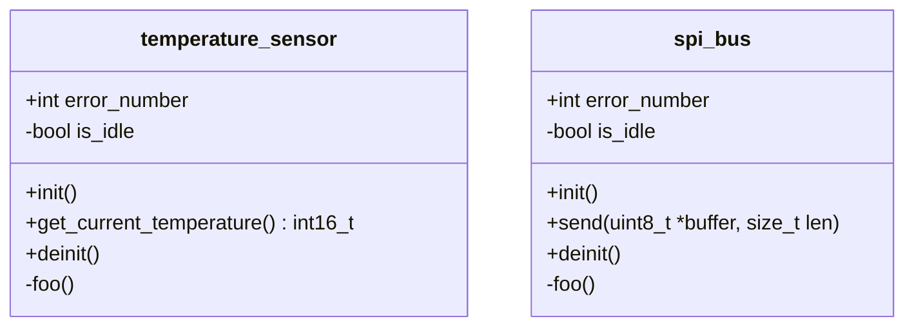

# 2-modularity

Step by step example to show how to achieve modularity in C.

Let's say these are the modules I want to implement.

Where:

* The `init()` and `deinit()` function for each module initialize and deinitialize the module.
* The `send()` function sends the given bytearray to a communication link (SPI in this case). We simulate `send()` using `printf()`.
* The `get_current_temperature()` function reads the current temperature. We simulate `get_current_temperature()` using `scanf()`.
* The `foo()` function for each module is a private function for each module.
* The `error_number` variable of each module gives error information in case of error.
    * Is it a good error handling mechanism? Probably not. This is just a toy example to showcase some aspects of the C language.
* The `is_idle` variable is to protect from concurrent calls to the `send()` and `get_current_temperature()` functions. If `is_idle` is `false` then `send()` and `get_current_temperature()` shouldn't do anything. It's not the correct way to protect a resource in a multithreaded scenario. But let's gloss over that.

We want our program to:

1. Initialize the modules
2. Forever:
    1. Read the temperature
    2. Send it through SPI
