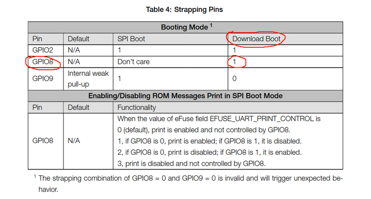

# Fixed SPI communication example

You may have noticed the two firmwares in the [spi-slave example](https://github.com/espressif/esp-idf/blob/8153bfe4125e6a608abccf1561fd10285016c90a/examples/peripherals/spi_slave/README.md), which shows to how to make two ESP32C3s communicate using SPI, one acting as SPI master and one as SPI slave.

Today (Wednesday 2022-05-11) during the lab coding session with some of your classmates we discovered some pitfalls of this example. Here you can find a step by step fix of this example, to make it work on the hardware setup that was provided you for the lab.

As always, I start from step 0, which is the identical copy of the original example taken from ESP-IDF v4.4 (see [here](https://github.com/espressif/esp-idf/blob/8153bfe4125e6a608abccf1561fd10285016c90a/examples/peripherals/spi_slave/README.md)) and modify the code step by step. You can use your preferred diffing tool to see what exactly was changed in each step.

## 0

Same as the [original example](https://github.com/espressif/esp-idf/blob/8153bfe4125e6a608abccf1561fd10285016c90a/examples/peripherals/spi_slave/README.md).

You can build the two firmwares (sender and receiver) and flash them on the two ESP32C3s that you have. Now, if everything were correct you could plug the two ESP32C3s in the custom board that were provided you and you would see from `idf.py monitor` that the two ESP32C3s are communicating. But it doesn't happen. The two ESP32C3s are not communicating.

## 1

You know that SPI is a master-slave protocol, where only the master (the `sender` firmware in our case) can initiate the communication. You need therefore a mechanism independent from SPI for the slave (the `receiver` firmware in our case) to signal the master that it wants to initiate the communication or that it is ready to sustain the communication. Indeed that's what the two example firmwares do with the `Handshake` signal: the master waits until the slave raises this signal (by using a GPIO).

From the README of the example, you can see that `GPIO3` is being used as `Handshake` signal, but if you look at the updated schematics the pins of the two ESP32C3s that are connected on our lab custom board correspond to `GPIO8`. Therefore, we need to change the GPIO used for the `Handshake` signal in the source code.

## 2

If you build the fixed examples of the previous step, you should see that *some* communication is happening between the two ESP32C3s. But the communication stops after a few messages, while from the code we see that it is an infinite loop so the communication should run forever.

Well, the problem lies in [the GPIO interrupt handler of the `sender` firmware](https://github.com/espressif/esp-idf/blob/8153bfe4125e6a608abccf1561fd10285016c90a/examples/peripherals/spi_slave/sender/main/app_main.c#L94-L100). That code was written to mitigate some hardware-level signal interference that could lead to some unintended IRQs to be signaled to the master. However, it seems that ignoring interrupts within `240000` CPU counts is too drastic and causes real interrupts raised by the slave (the `receiver` firmware) to be erroneously ignored, causing the communication to stop.

Therefore, we remove these lines.

## 3

If you build the fixed examples of the previous step, you should see now a continuous communication between the two ESP32C3s.

Final problem: while the two ESP32C3s are are plugged in the custom board and while the two firmwares are running, if you try to flash the ESP32C3 that is now running the `sender` firmware, it doesn't work.

.

As you can see from the [datasheet, p.15](https://www.espressif.com/sites/default/files/documentation/esp32-c3_datasheet_en.pdf) The problem is that in order to enter into "flashing mode" (i.e. the "download boot" mode), the pins GPIO8 must be HIGH (1) after reset, but we are using the GPIO8 as `Handshake` signal from slave to the master. The slave (receiver firmware) actively pulls the `Handshake` signal to LOW most of the times and raises it only to signal the master that it is ready for communication. Therefore, the master ESP32C3s is not able to enter into "flashing mode".

If you have a solder iron you could connect another GPIO of the two ESP32C3s and use that instead of GPIO8. Otherwise, as often happens, hardware limitations can be worked around using software.
We need to invert the signaling logic: let the `Handshake` be HIGH by default and make the slave pull the line low to signal the master that it is ready. This way the `Handshake`, and thus GPIO8, is almost always HIGH and when we need to flash the ESP32C3 on which the `sender` firmware is running, that ESP32C3 can successfully enter into "download boot" mode.

So there are two places we need to modify:

* In the `receiver` firmware (the slave): pull `Handshake` down when ready and pull it up otherwise.
* In the `sender` firmware: configure the GPIO interrupt so that an IRQ is signaled when the line falls down, rather than when the line rises up.
